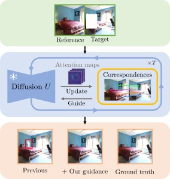
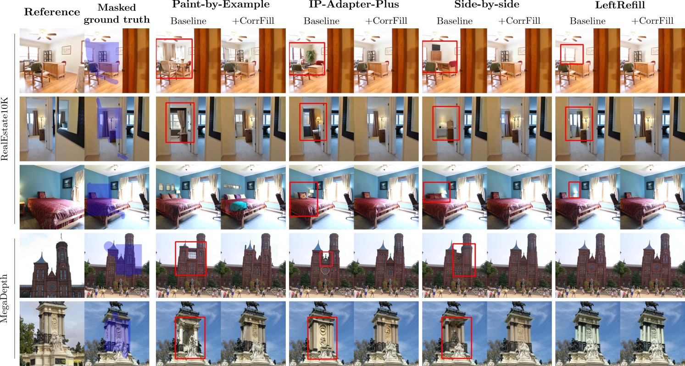

# [WACV'25] CorrFill: Enhancing Faithfulness in Reference-based Inpainting with Correspondence Guidance in Diffusion Models
<p align="center">
    
</p>

The Official PyTorch implementation of [**CorrFill: Enhancing Faithfulness in Reference-based Inpainting with Correspondence Guidance in Diffusion Models (WACV'25)**](https://corrfill.github.io/).  

Kuan-Hung Liu<sup>1</sup>,
[Cheng-Kun Yang](https://scholar.google.com.hk/citations?user=Ke4_ozgAAAAJ)\*<sup>2</sup>,
[Min-Hung Chen](https://minhungchen.netlify.app/)<sup>3</sup>,
[Yu-Lun Liu](https://yulunalexliu.github.io/)<sup>1</sup>,
[Yen-Yu Lin](https://sites.google.com/site/yylinweb/)<sup>1</sup><br>
<sup>1</sup>National Yang Ming Chiao Tung University, <sup>2</sup>National Taiwan University, <sup>3</sup>NVIDIA<br>
(\*Now at MediaTek Inc., Taiwan.)

[[`Paper`](https://arxiv.org/pdf/2501.02355)] [[`Website`](https://corrfill.github.io/)] [[`BibTeX`](#citation)] [[`WACV'25 Poster`]()]

This work introduces **CorrFill**, a training-free module designed to enhance the faithfulness of reference-based image inpainting in diffusion models. CorrFill guides the inpainting process with correspondence between the reference and target images, estimated during the inpainting process, by constraining the inpainting process of diffusion models through self-attention masking and input latent optimization. We conduct experiments on RealEstate10K and MegaDepth with four different baseline diffusion models, which demonstrate higher faithfulness in both quantitative and qualitative results.  

For business inquiries, please visit our website and submit the form: [NVIDIA Research Licensing](https://www.nvidia.com/en-us/research/inquiries/).

## Installation
### Prerequisite

* [pytorch 2.0.1 & torchvision](https://pytorch.org/get-started/locally/)

### Environment Setup
This code base requires `Python 3.10`.
```
git clone git@github.com:khliu0000/corr_inpainting.git
cd corr_inpainting
conda env create --file environment.yml python=3.10
```
## Experiment Setup
### Models
Most of the required models will be automatically downloaded through huggingface when first executed.  

Reproducing IP-Adapter-Plus with CorrFill requires *runwayml*'s Stable Diffusion, which is currently unavailable. However, you can use other inpainting models that are compatible with IP-Adapter-Plus.  

The image encoder of IP-Adapter-Plus and the weights for the adapter are required to reproduce results for IP-Adapter-Plus with CorrFill.  
Please download ```models/image_encoder/*``` and ```models/ip-adapter-plus_sd15.bin``` from the [huggingface repository](https://huggingface.co/h94/IP-Adapter), and place it as this structure:  
```
corr_inpainting    # repo root
├── IP-Adapter
│   └── models
│       ├── image_encoder
│       └── ip-adapter-plus_sd15.bin
...
```

### Dataset
Due to copyright restrictions, we cannot provide our testing data. However, we offer examples of how we generate image pairs and random masks. Please refer to ```./data_process/```.   

## How to reproduce experiments
<p align="center">
    
</p>

* To reproduce the experiments, it is recommended to execute with at least 24GB of memory.  
* Disable latent input optimization will reduce the amount of memory required, but it will also lower the performance.
    * To disable latent optimization, set ```latent_optimize``` in the configure files to ```false``` in the config files.  
* The model is in ```float16``` mode by default.  
* Results may vary slightly with each execution. Please refer to [PyTorch's documentation on reproducibility](https://pytorch.org/docs/stable/notes/randomness.html).

The results will be stored in ```./results/```. Please follow the below commands for reproduction.  

### LeftRefill
* RealEstate10K
```bash
python corr_guided.py --config config/leftrefill_realestate.json
```
* MegaDepth
```bash
python corr_guided.py --config config/leftrefill_megadepth.json
```

### Side-by-side
* RealEstate10K
```bash
python corr_guided.py --config config/sidebyside_realestate.json
```
* MegaDepth
```bash
python corr_guided.py --config config/sidebyside_megadepth.json
```

### IP-Adapter-Plus
* RealEstate10K
```bash
python corr_guided.py --config config/ipadapter_realestate.json
```
* MegaDepth
```bash
python corr_guided.py --config config/ipadapter_megadepth.json
```
The directory ```ipa_embed``` will be created to cache the image embedding for saving memory.  

### Paint-by-Example
* RealEstate10K
```bash
python corr_guided.py --config config/paintbyexample_realestate.json
```
* MegaDepth
```bash
python corr_guided.py --config config/paintbyexample_megadepth.json
```
The directory ```pbe_embed``` will be created to cache the image embedding for saving memory.  

## Code Structure
* `corr_guided.py`: Script for repreduce experiments.
* `corrfill_module`: Implementation of our main method.
    * `corrfill_module/corrfill.py`: Code for CorrFill inpainting method, including attention processor swapping and attention maps collections.
    * `corrfill_module/cg_pipeline.py`: Code for customized diffusers pipeline of CorrFill.
    * `corrfill_module/pbe_pipeline.py`: Code for customized diffusers pipeline of CorrFill, for the experiments of PaintByExample.
    * `corrfill_module/pbe_image_encoder.py`: Code for image encoder used by PaintByExample from [diffusers](https://huggingface.co/docs/diffusers/api/pipelines/paint_by_example).
    * `corrfill_module/utils.py`: Code loss calculation for both pipelines.
    * `corrfill_module/share.py`: Shared objects used globally.
* `data_process`: Exemplar scripts for dataset processing for reference.
* `ip_adapter`: IP-Adapter modules for experiments of IP-Adapter Plus from [IP-Adapter](https://github.com/tencent-ailab/IP-Adapter).


## Acknowledgement

### Code

* The implementation is based on huggingface [diffusers](https://github.com/huggingface/diffusers).
* The implementation of latent optimization is inspired by [Diffusion Self-Guidance for Controllable Image Generation](https://dave.ml/selfguidance/) and [HD-Painter](https://github.com/Picsart-AI-Research/HD-Painter).
* The IP-Adapter Plus module is adapted from [tencent-ailab](https://github.com/tencent-ailab/IP-Adapter).
* The PaintByExapmle module is implemented by [diffusers](https://huggingface.co/docs/diffusers/api/pipelines/paint_by_example).
* The implementation of LeftRefill is adapted from [ewrfcas](https://github.com/ewrfcas/LeftRefill).
* The example script for `RealEstate10K` collection is adapted from [RealEstate10K downloader](https://github.com/cashiwamochi/RealEstate10K_Downloader).
* The example script for mask generation is adapted from [Tangshitao](https://github.com/Tangshitao/QuadTreeAttention)'s implementation of QuadTreeAttention for [LoFTR](https://github.com/zju3dv/LoFTR).

### Weights and Biases
* The learned prompt embeds of LeftRefill are extracted from the release weights of [LeftRefill](https://github.com/ewrfcas/LeftRefill).

### Dataset
* `RealEstate10K` dataset is extracted [Youtube](https://www.youtube.com/) frames annotated by [Google](https://google.github.io/realestate10k/).
* `MegaDepth` dataset is collected from [MegaDepth project](https://www.cs.cornell.edu/projects/megadepth/).

## Citation
If you find CorrFill useful, please consider giving a star and citation:

```bibtex
@inproceedings{liu2025corrfill,
  title={CorrFill: Enhancing Faithfulness in Reference-based Inpainting with Correspondence Guidance in Diffusion Models},
  author={Liu, Kuan-Hung and Yang, Cheng-Kun and Chen, Min-Hung and Liu, Yu-Lun and Lin, Yen-Yu},
  booktitle={WACV},
  year={2025}
}
```

## Licenses

Copyright © 2024, NVIDIA Corporation. All rights reserved.

This work is made available under the NVIDIA Source Code License-NC. Click [here](LICENSE) to view a copy of this license.
